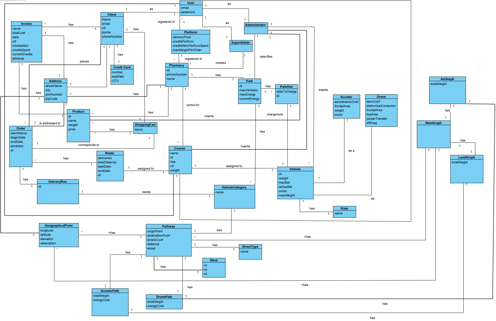

# Domain Model

A domain model was developed to represent the general business concepts. This diagram was updated throughout the development of the software, every time the client made a requirement that affected the structure of project.

---

[Back](../Documentation.md)