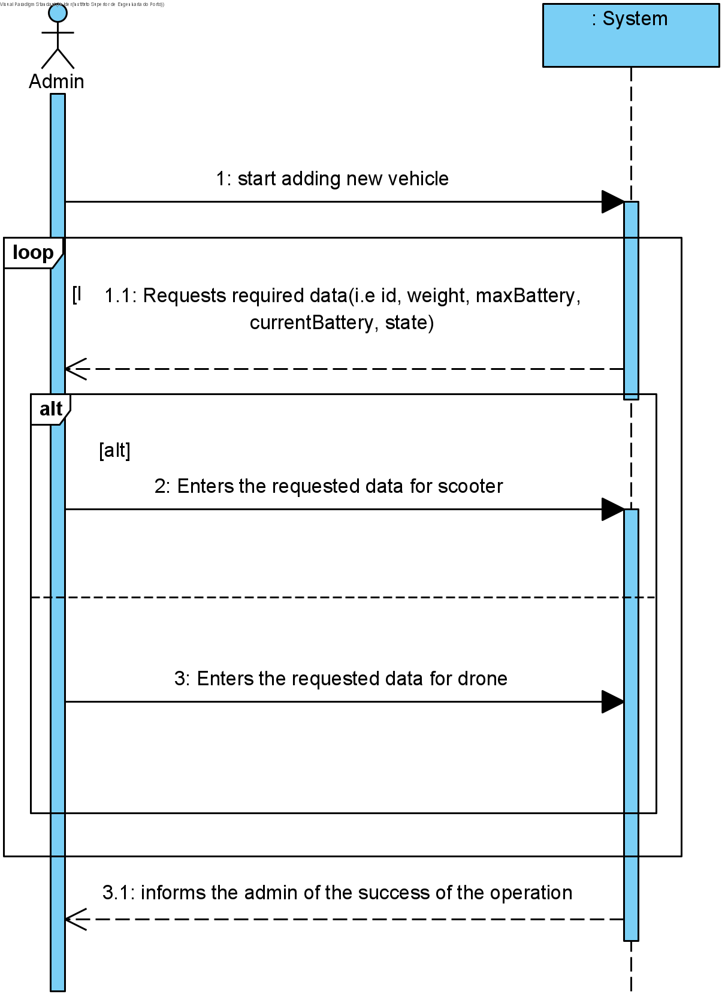

# UC2 - New Vehicle

## 1. Requirements Engineering

The admin start adding a vehicle. The system requests required data. The admin enters the requested data. The system shows data and ask for confirmation. The admin confirms. The system informs the admin of the succes of the operation.

### SSD

#### Main Actor

Admin

#### Stakeholders and their interests
* **Admin:** wants to add a vehicle.
* **Courier:** wants to have the vehicle to do a delivery.

## 2. Engineering Design

### Sequence Diagram

### Class Diagram

