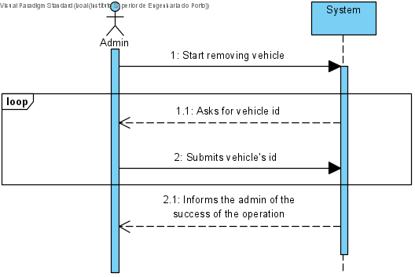
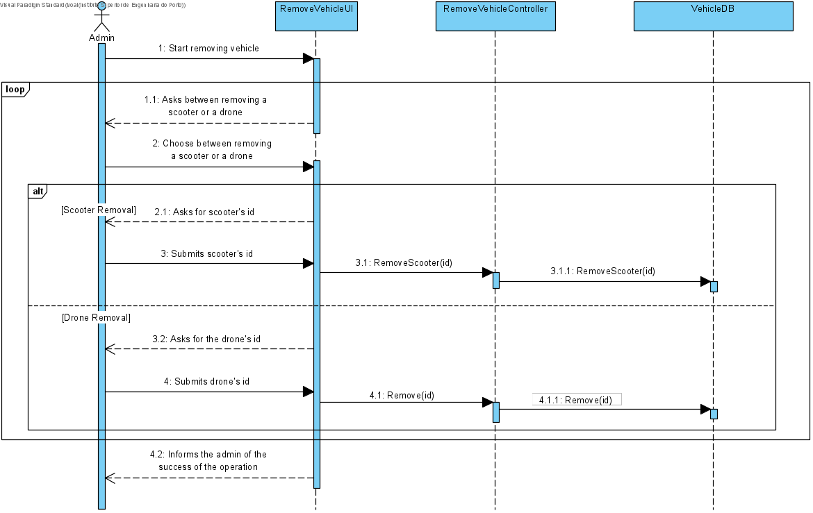
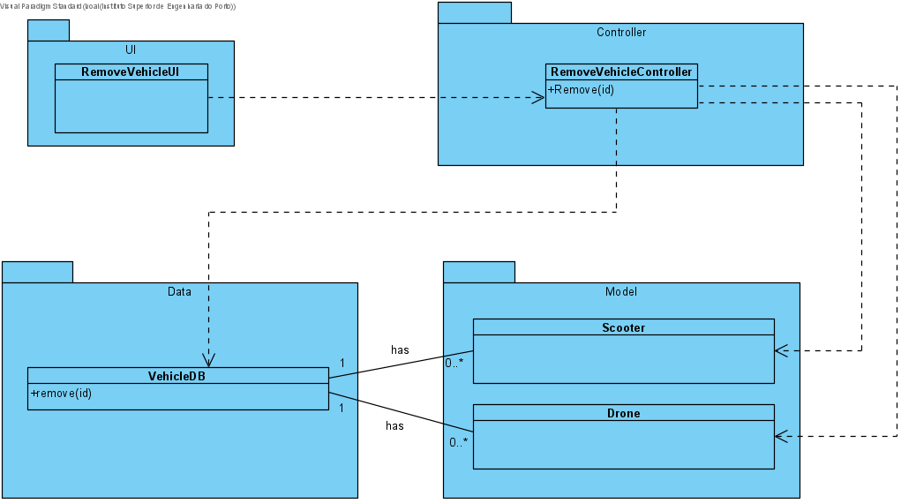

# UC3 - Remove Vehicle

## 1. Requirements Engineering

The admin start removing an existing vehicle. The system sasks data. The admin enters data. The system informs the admin of the succes of the operation.

### SSD

#### Main Actor

Admin

#### Stakeholders and their interests
* **Admin:** wants to remove a scooter.
* **Courier:** wants to known the scooter that is no more available.

#### Pre Conditions
The scooter should be already defined..

## 2. Engineering Design

### Sequence Diagram

### Class Diagram

