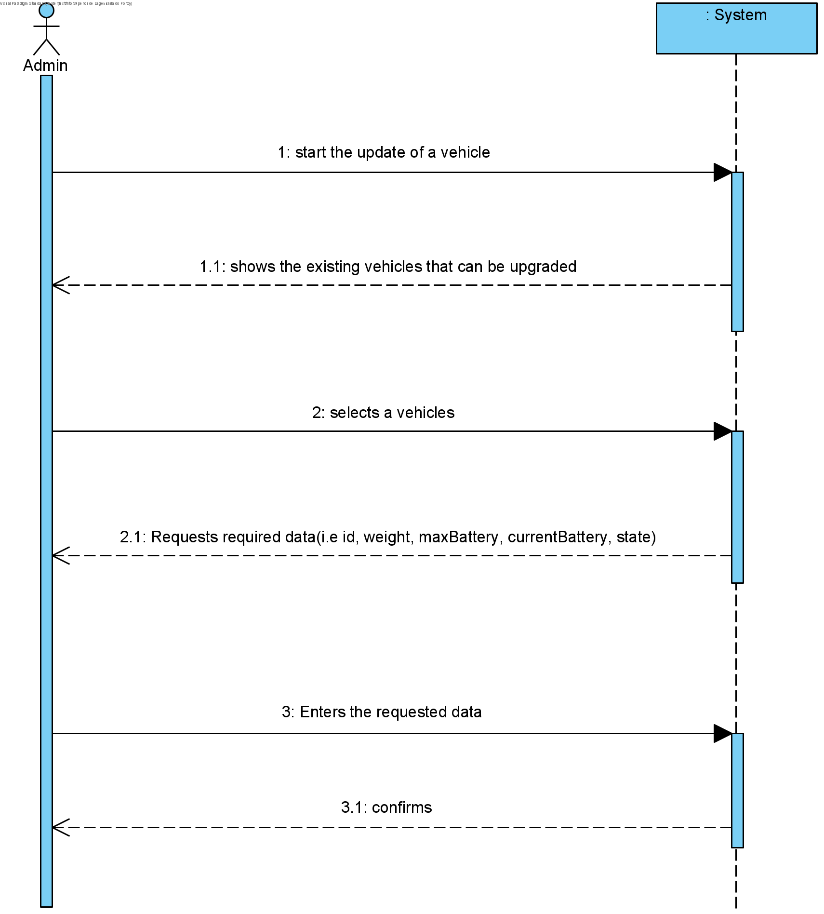

# UC4 - Update Scooter

## 1. Requirements Engineering

The admin start the update of a scooter. The system shows the existing vehicles that can be upgraded. The admin selects a scooter. The system requests required data. The admin enters requested data. The system shows data and ask for confirmation. The admin confirms. The system informs the admin of the succes of the operation.

### SSD

#### Main Actor

Admin

#### Stakeholders and their interests
* **Admin:** wants to update a scooter.
* **Courier:** wants to have the scooter information updated.

#### Pre Conditions
The scooter should be already defined..

## 2. Engineering Design

### Sequence Diagram

### Class Diagram

