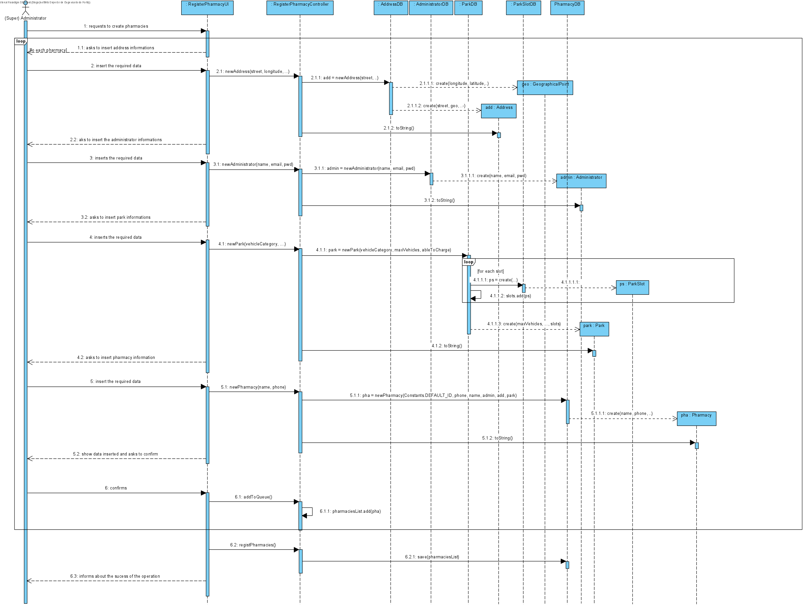

# UC5 - Create Pharmacy

## 1. Requirements Engineering

The admin starts creating a new Pharmacy. The system requests required data(id, phoneNumber,name,admin,address,parks). The admin enters the requested data. The system show data and asks for confirmation. The admin confirms. The system informs about the success of the operation.

### SSD

#### Main Actor

Admin

#### Stakeholders and their interests
* **Admin:** wants to add a Pharmacy in the system.
* **Pharmacy:** wants be registed in the system.

#### Pre Conditions
The admin must be logged in.

#### Post Conditions
The pharmacy is reggisted and can start selling products

## 2. Engineering Design

### Sequence Diagram

### Class Diagram

