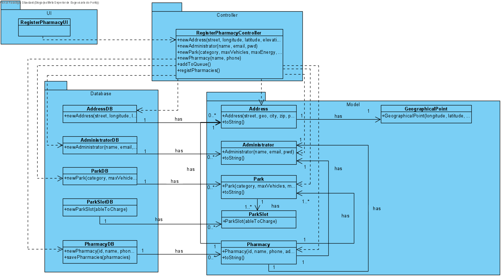

# UC5 - Register Pharmacy

## 1. Requirements Engineering

The (Super) administratos starts the regist of new pharmacies.The system requests toinsert address informations. The administrator inserts the requested data. The system asks to insert the pharmacy administrator information. The administrator inserts the requested data. The system asks to insert park information. The administrator inserts the requested data. The system asks to insert pharmact details. The administrator inserts the required data. The system shows data and asks to confirm. The administrator confirms. The system informs about the sucess of the operaration.

### SSD

#### Main Actor

(Super) Administrator

#### Stakeholders and their interests
* **Admin:** wants to add a Pharmacy in the system.
* **Pharmacy:** wants be registed in the system.

#### Pre Conditions
The admin must be logged in.

#### Post Conditions
The pharmacy is reggisted and its administrator can do login.

## 2. Engineering Design

### Sequence Diagram

### Class Diagram

