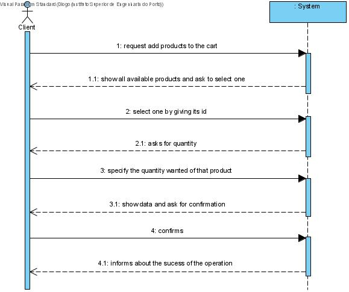
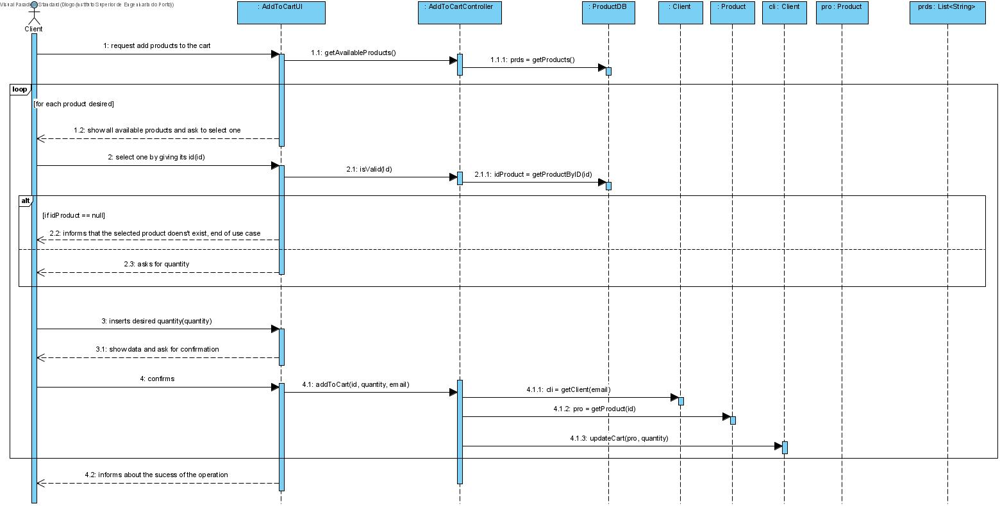

# UC6 - Add to Cart

## 1. Requirements Engineering

The client requests to add products to the shopping cart.The system show all available products and asks to select one. The client selects the one he want to add to the shopping cart by giving its id. The system aks for the quantity of the selected product he wants. The client specifies the quantity. The system show data and ask for confirmation. The client confirms. The System informs about the sucess of the operation.

### SSD

#### Main Actor

Client

#### Stakeholders and their interests
* **Client:** wants to add products to its cart so that he can buy it later.

#### Pre Conditions
The client must be logged in to see the available products.

#### Post Conditions
The items in the shopping cart are stored until he pays for it (or log out).

## 2. Engineering Design

### Sequence Diagram

### Class Diagram

