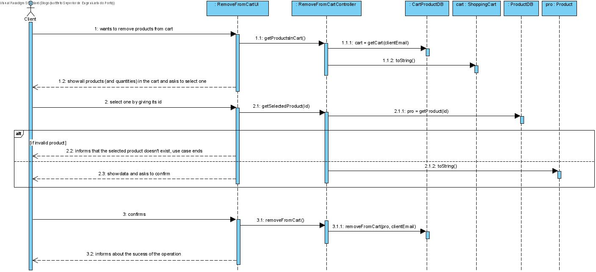

# UC7 - Remove from Cart

## 1. Requirements Engineering

The client wants to remove a product from his shopping cart. The system shows the products (and quantities) that are in the cart and asks to select one. The client select one by giving its id. The system show data and asks for confirmation. The client confirms. The system informs about the success of the operation.

### SSD

#### Main Actor

Client

#### Stakeholders and their interests
* **Client:** wants to remove products from the cart that he doesn't want to buy.

#### Pre Conditions
The client must be logged in to see the available products.

#### Post Conditions
n/a

## 2. Engineering Design

### Sequence Diagram

### Class Diagram

