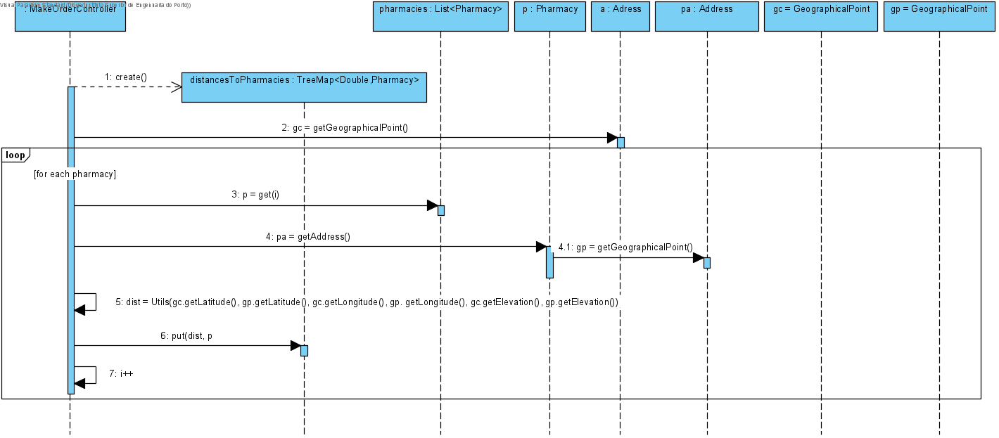
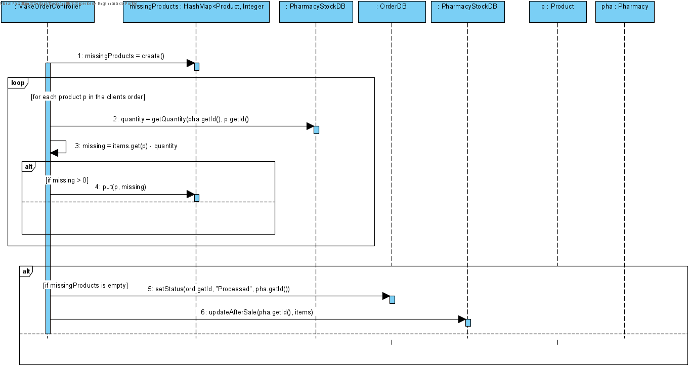

# UC8 - Make Order

## 1. Requirements Engineering

The client starts to make an order. The system shows the items in the shopping cart and the total price and asks to confirm. The client confirms. The system shows the address where the order will be sent to and asks to confirm. The client confirms. The system ask to insert the desired nif. The client inserts the desired nif. The system shows the current credits and asks if the client wants to use them to have a discount.The client wants to discount.The system shows the final price and asks to confirm. The client confirms. The system creates the order, send the invoice to client's email and informs abour the sucess of the operation.
### SSD

#### Main Actor

Client

#### Stakeholders and their interests
* **Client:** wants to make orders and receive it in home.
* **Phamarcy:** wants to sell its products.

#### Pre Conditions
The client must be logged in as client.
The client should have at least one product in the sohhping cart.

#### Post Conditions
An email with the invoice is sent to client.

## 2. Engineering Design

### Sequence Diagram

### Class Diagram

