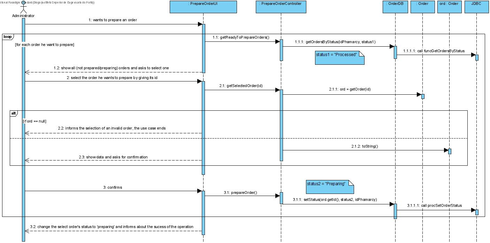
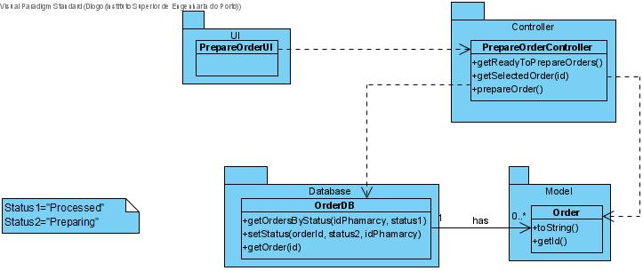

# UC7 - Prepare Order

## 1. Requirements Engineering

The (phamarcy) administrator wants to prepare an order. The system shows all the phamarcy's orders which not been prepared yet and asks to select one. The (phamarcy) administrator selects one by giving its id. The system shows data about the selected order and asks for confirmation. The (phamarcy) administrator confirms. The system change the status of the selected order to 'preparing' and informs about the sucess of the operation.

### SSD

#### Main Actor

(Phamarcy) Administrator

#### Stakeholders and their interests
* **Phamarcy:** wants to prepare orders so that the couriers can pick it later.
* **Courier:** wants the order to be prepared so that he can deliver it.
* **Client:** wants its order to be prepared to be delivered to him.

#### Pre Conditions
The (phamarcy) administrator must be logged in.

#### Post Conditions
The new status ('preparing') of each selected order, are saved in database.

## 2. Engineering Design

### Sequence Diagram

### Class Diagram

