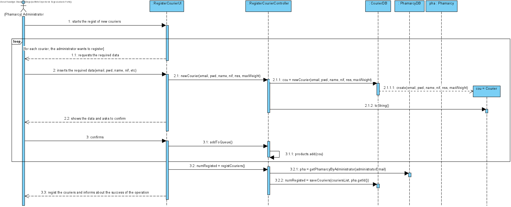
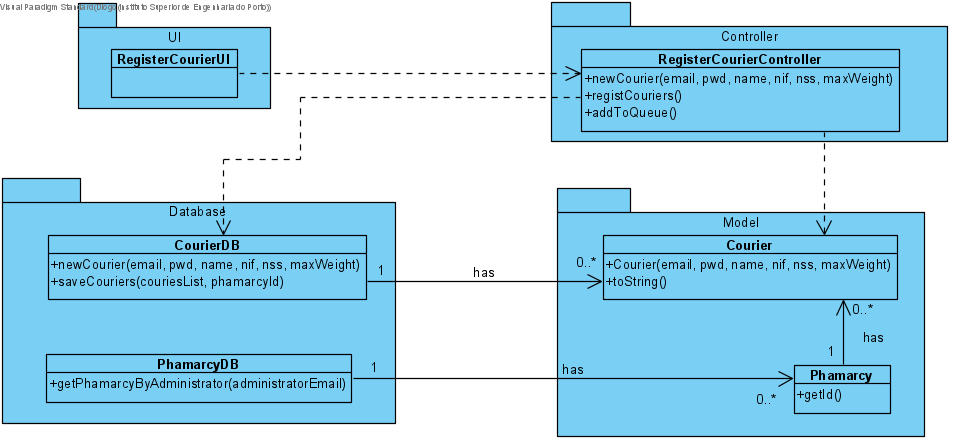

# UC10 - Add Courier

## 1. Requirements Engineering
The (Phamarcy) administratorstarts the regist of new couries. The system requests the required data. The (Phamarcy) administrator inserts the required data (email, password, name, nif, nss, max weight can carry). The system shows the entered data ans asks to confirm. The (Phamarcy) administrator confirms. The system regist the courier(s) and informs about the sucess of the operation.

## SSD

#### Main Actor

(Phamarcy) Administrator

#### Stakeholders and their interests
* **Phamarcy:** wants to add couriers to deliver products.
* **Courier:** wants to deliver products.

#### Pre Conditions
The administratro should be logged in as an existing phamarcy administrator.

## 2. Engineering Design

### Sequence Diagram

## Class Diagram

