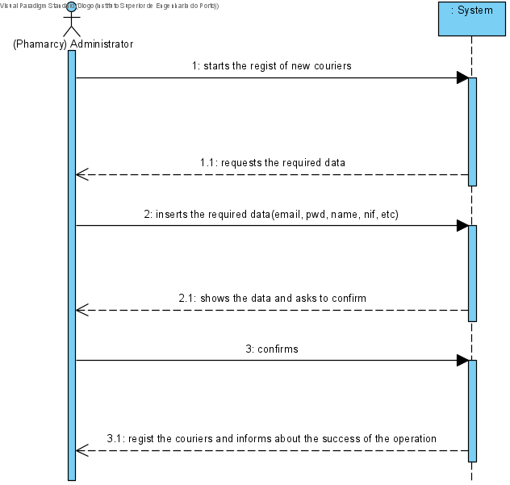

# UC10 - Add Courier

## 1. Requirements Engineering
The Pharmacy start adding couriers. The system requests data (i.e. name, weight, price). The pharmacy enters the requested data. The system shows data and ask for confirmation. The pharmacy confirms. The system onforms the success od operation.

## SSD

#### Main Actor

Pharmacy

#### Stakeholders and their interests
* **Pharmacy:** wants to add couriers to deliver products.
* **Courier:** wants to deliver products.

#### Pre Conditions
The pharmacy should be created in the system.

## 2. Engineering Design

### Sequence Diagram

## Class Diagram

