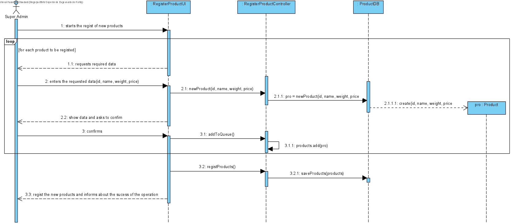

# UC11 - Register Product

## 1. Requirements Engineering
The super admin starts the regist of new products. The system requests required data. The super admin enteres the data (id, name, weight, price). The system shows the entered data ans asks to confirm. The super admin confirms. The system regists the new product(s) and informs about the sucess of the operation.
## SSD

#### Main Actor

Super Admin

#### Stakeholders and their interests
* **Admin:** wants to add products to the platform.

#### Pre Conditions
The super admin must be logged in.

## 2. Engineering Design

## Sequence Diagram

## Class Diagram

____

[Back to Use Cases](../UseCases.md)