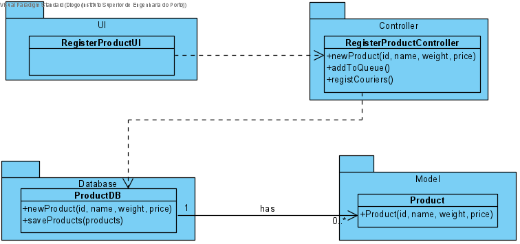

# UC10 - Add Courier

## 1. Requirements Engineering
The admin start adding products. The system requests required data(i.e. id, name, weight, price). The admin enters the data.The system shows data and ask for confirmation. The admin confirms. The system informs the admin of the succes of the operation.

## SSD

#### Main Actor

Admin

#### Stakeholders and their interests
* **Admin:** wants to add products in the pharmacy.
* **Pharamcy:** wants to have products.

#### Pre Conditions
The pharmacy should be created in the system.

## 2. Engineering Design

## Sequence Diagram

## Class Diagram

____

[Back to Use Cases](../UseCases.md)