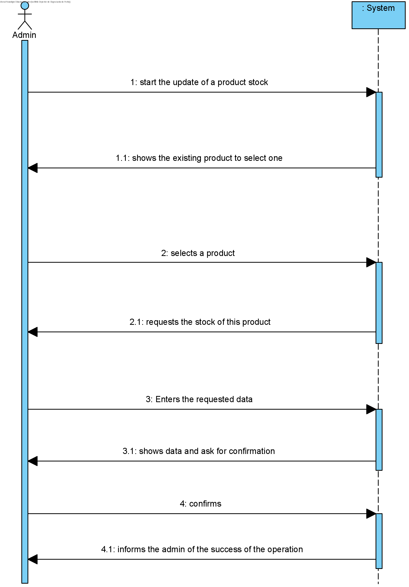
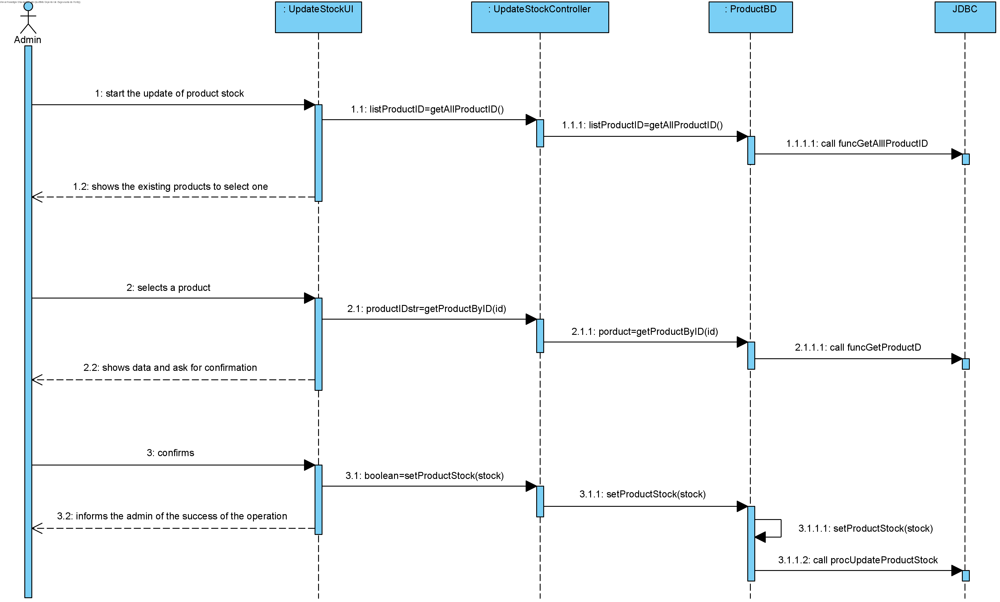
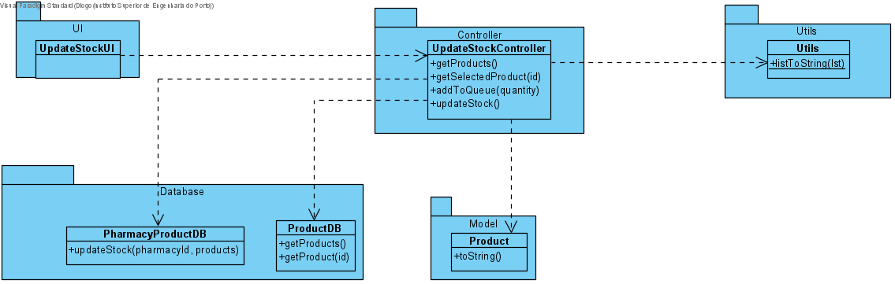

# UC12 - Update Stock

## 1. Requirements Engineering
The (Phamarcy) administrator starts the update of stock. The system shows all available products and asks to select one. The (Phamarcy) administrator selects one product. The system asks to insert the desired quantity. The (Pharmacy) administrator inserts the quantity. The system shows data and asks to confirm. The (Pharmacy) administrator confirms. The system informs about the sucess of the operation.
## SSD

#### Main Actor

(Phamarcy) Administrator

#### Stakeholders and their interests
* **Administrator:** wants to update the stock of products of its phamarcy.
* **Pharmacy:** wants to keep thei stcok updated.	.

#### Pre Conditions
The administrator should be logged in.

## 2. Engineering Design

## Sequence Diagram

## Class Diagram

____

[Back to Use Cases](../UseCases.md)