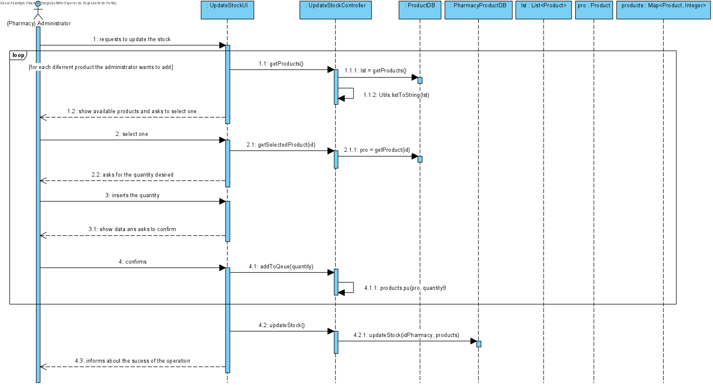

# UC12 - Update Stock

## 1. Requirements Engineering
The admin start the update of a product. The system shows the existing product to select one. The admin selects a product.The system shows data and ask for confirmation. The admin confirms. The system informs the admin of the succes of the operation.

## SSD

#### Main Actor

Admin

#### Stakeholders and their interests
* **Admin:** wants to have a stock updated.
* **Pharmacy:** wants to know their product stock.	.

#### Pre Conditions
Should exist at leats one product in the datebase

## 2. Engineering Design

## Sequence Diagram

## Class Diagram

____

[Back to Use Cases](../UseCases.md)