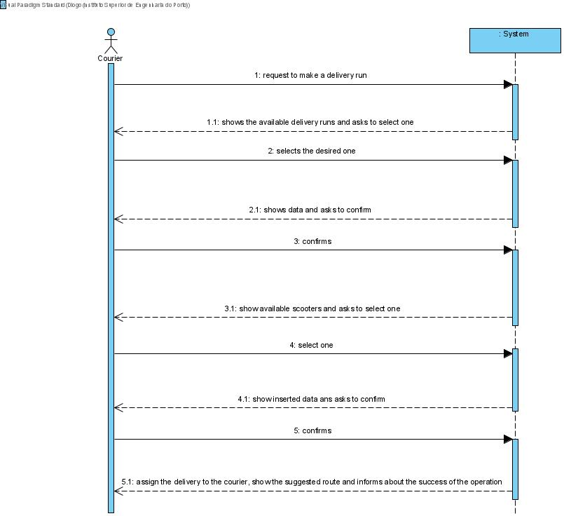
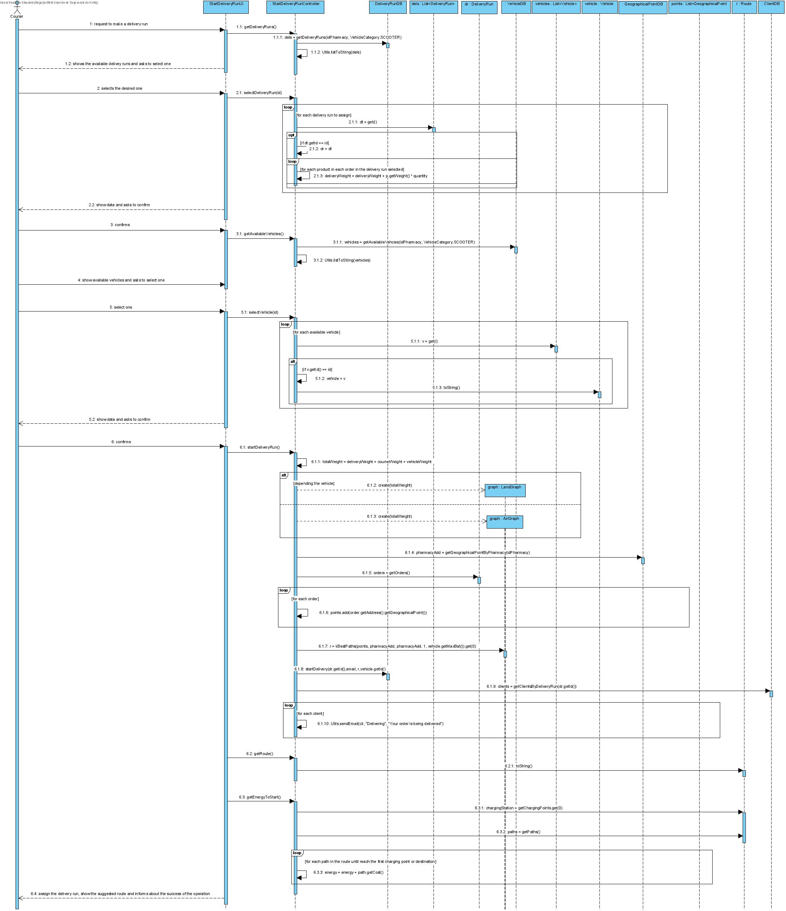

# UC13 - Deliver Order

## 1. Requirements Engineering
The courier requests to deliver orders. The system show the suggested order's data and asks to confirm. The courier confirms. The system determines and show the less spending route and asks to confirm. The courier confirms. The system assign the orders to the courier, set the status as being delivering and informs about the sucess of the operation.

## SSD

#### Main Actor

Courier

#### Stakeholders and their interests
* **Courier:** wants to deliver orders.
* **Client:** wants its orders to be delivered quickly as possible.

#### Pre Conditions
The courier should be logged in.

## 2. Engineering Design

## Sequence Diagram

## Class Diagram

____

[Back to Use Cases](../UseCases.md)