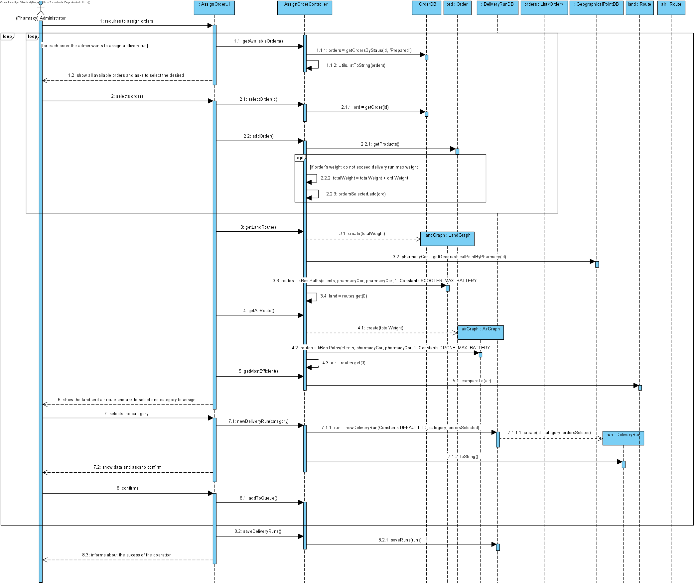

# UC14 - Assign Orders

## 1. Requirements Engineering
The (Pharmacy) administrator requires to assign orders. The system show all available orders and ask to select the desired ones. The administrator selects. The system shows the best land and air route  (and its costs) and asks to select one category. The administrator selects. The system shows data ans asks to confirm. The administrator confirms. The system informs about the sucess of the operation.

## SSD

#### Main Actor

(Pharmacy) Administrator

#### Stakeholders and their interests
* ** Pharmacy: Wants to assign to best category.
* ** Courier: Wants orders to be assigned to them so that they can deliver it.	.

#### Pre Conditions
The administrator should be logged in.

## 2. Engineering Design

## Sequence Diagram

## Class Diagram

____

[Back to Use Cases](../UseCases.md)