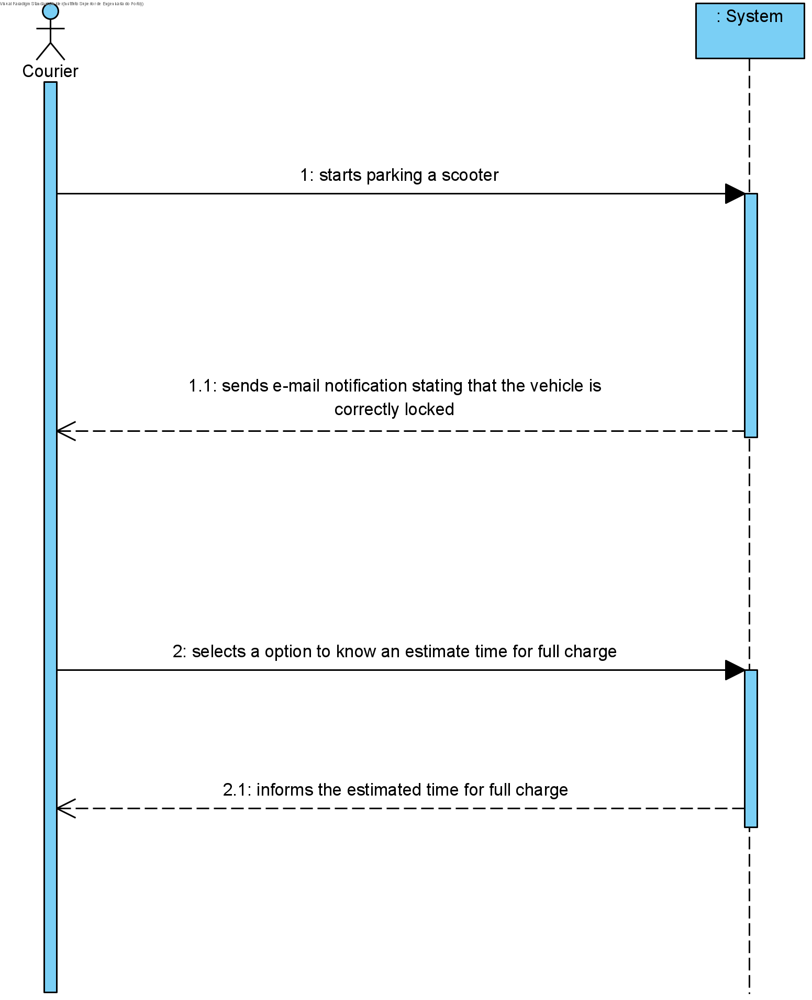

# UC15 - Parking Scooter

## 1. Requirements Engineering
The courier starts parking a scooter. The system sends e-mail notification stating that the vehicle is correctly locked . The courier selects a option to know an estimate time for full charge. The system informs the estimated time for full charge.

## SSD

#### Main Actor

Courier

#### Stakeholders and their interests
* ** Pharmacy: Wants to have their scooter well parked.
* ** Courier: Wants to have their scooter full charged in order to delivery orders.

#### Pre Conditions
The scooter has to be registed.

## 2. Engineering Design

## Sequence Diagram

## Class Diagram

____

[Back to Use Cases](../UseCases.md)