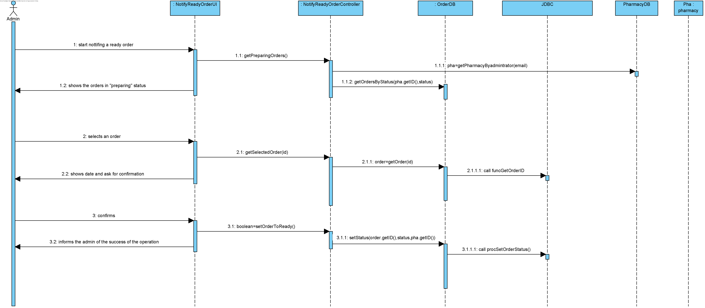
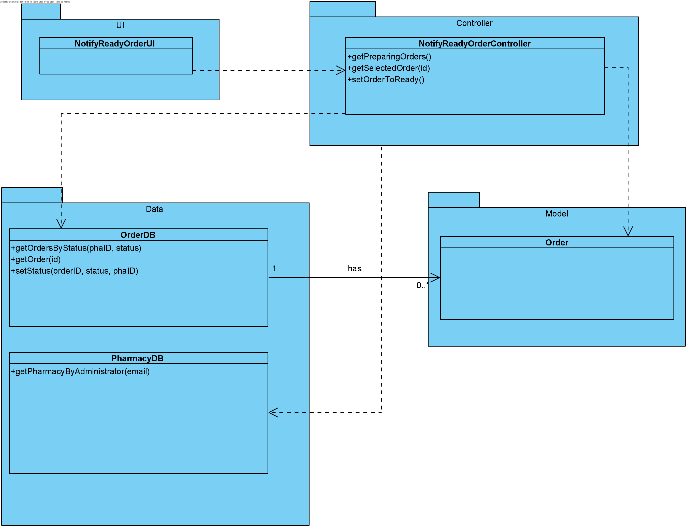

# UC16 - Notify Ready Order

## 1. Requirements Engineering
The admin start notifing a ready order. The system shows the orders in "preparing" status. The admin selects an order.The system shows data and ask for confirmation. The admin confirms. The system informs the admin of the succes of the operation.

## SSD

#### Main Actor

Admin

#### Stakeholders and their interests
* **Admin:** wants to have a order ready to delivery.
* **Courier:** wants that admin prepare order, so that courier can delivery it.	.

#### Pre Conditions
The order should be maked

## 2. Engineering Design

## Sequence Diagram

## Class Diagram

____

[Back to Use Cases](../UseCases.md)