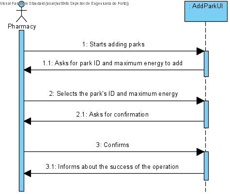
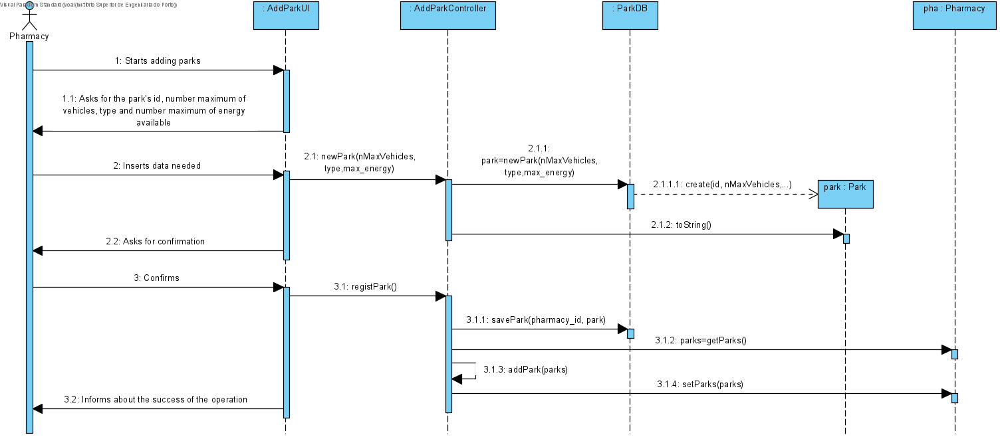
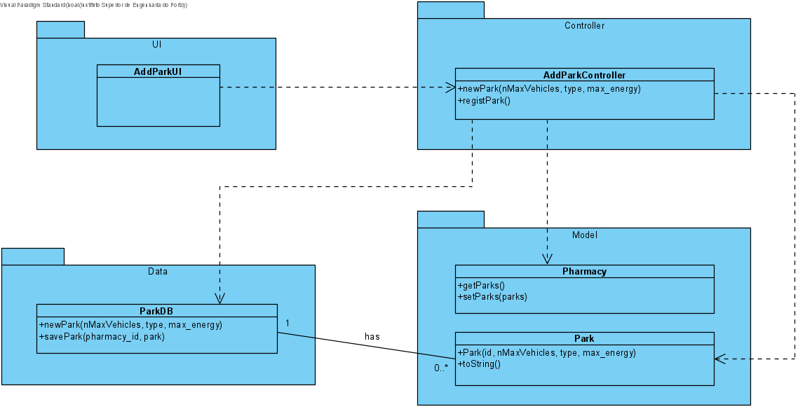

# UC17 - Add Park

## 1. Requirements Engineering
The pharmacy starts adding parks. The system asks the park ID to add. The pharmacy selects the park ID. The system asks for confirmation. The pharmacy confirms. The system informs the succes of the operation.

## SSD

#### Main Actor

Pharmacy

#### Stakeholders and their interests
* **Pharmacy:** wants to have parks to their pharmacy.
* **Courier:** wants to docks the scooter in the park	.

#### Pre Conditions
The park should be "created".

## 2. Engineering Design

## Sequence Diagram

## Class Diagram

____

[Back to Use Cases](../UseCases.md)