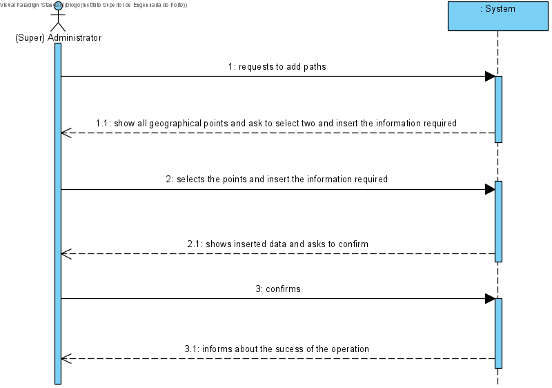
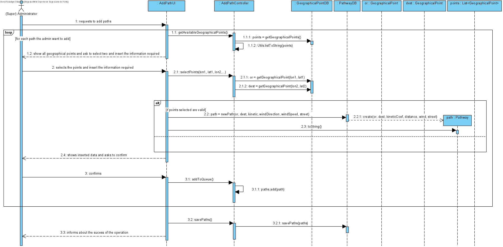
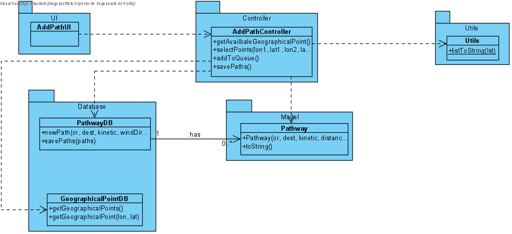

# UC18 - Add Path

## 1. Requirements Engineering
The administrator requests to add paths. The system show all geographical points and ask to select two (origin and destination) and insert the path information (kinetic coef, wind direction, wind speed, street name). The administrator inserts the required data. The system shows inserted data and asks to confirm. The administrator confirms. The system informs about the sucess of the operation.

## SSD

#### Main Actor

(Super) Administrator

#### Stakeholders and their interests
* ** Courier: Wants paths to be added so that he can know the best route for a certain delivery.	.

#### Pre Conditions
The administrator should be logged in.

## 2. Engineering Design

## Sequence Diagram

## Class Diagram

____

[Back to Use Cases](../UseCases.md)