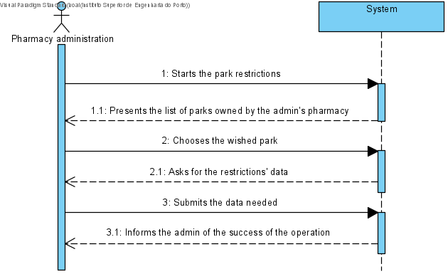
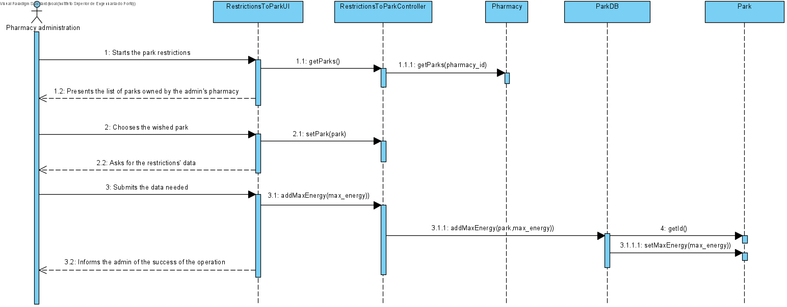
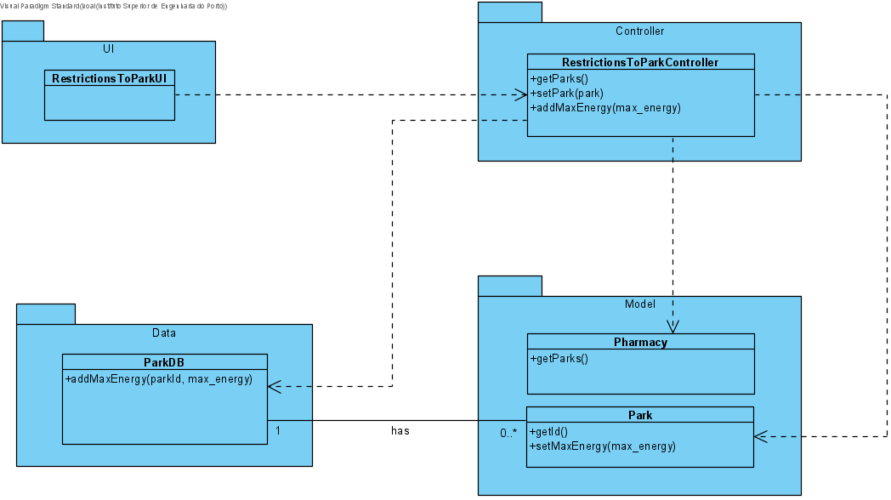

# UC19 - Restrictions To Park

## 1. Requirements Engineering

The admin starts the park restrictions. The system presents the list of parks owned by the admin's pharmacy. The admin chooses the wished park. The system asks for the restrictions' data. The admin submits the data needed. The system informs the admin of the succes of the operation.

### SSD

#### Main Actor

Pharmacy admin

#### Stakeholders and their interests
* **Pharmacy admin:** wants to apply restrictions to parks and limit power capacity that is shared by all parking spaces to improve the park system.
* **Courier:** wants to get notify whenever his vehicle gets a diferent amount of energy when charging due to the number of vehicles charging being modified.

#### Pre Conditions
The park has to already exist in the platform and associated with an also existing pharmacy..

## 2. Engineering Design

### Sequence Diagram

### Class Diagram

