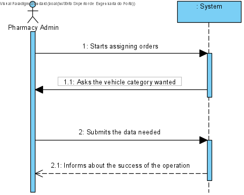
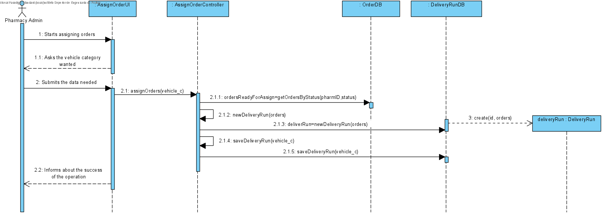
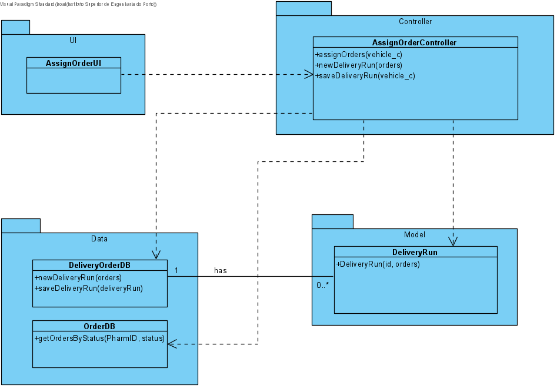

# UC21 - Assign Order

## 1. Requirements Engineering
The pharmacy administrator requests the assignment of the prepared orders. The system asks for the vehicle's category. The pharmacy administrator submits the data needed. The system Informs the pharmacy administrator about the success of the operation.

## SSD

#### Main Actor

Pharmacy Administrator

#### Stakeholders and their interests
* ** Client: Wants to have his delivery order assigned so that he can receive his brought products.
* ** Pharmacy Administrator: Wants to have his orders assigned and set to start the delivery run.

#### Pre Conditions
The pharmacy administrator should be logged in.

## 2. Engineering Design

## Sequence Diagram

## Class Diagram

____
