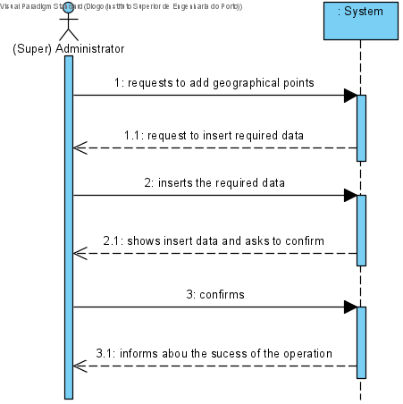
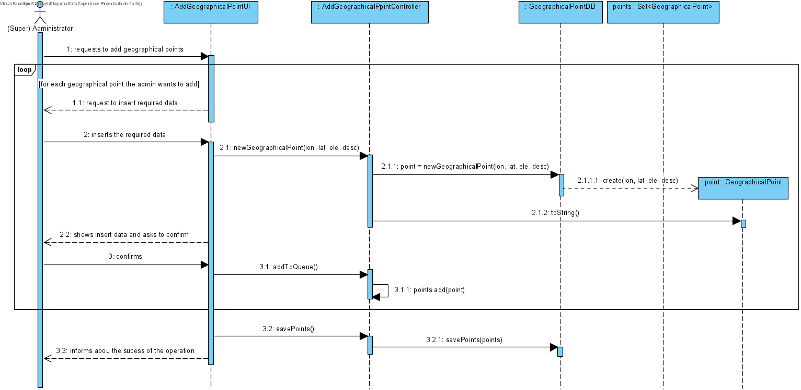
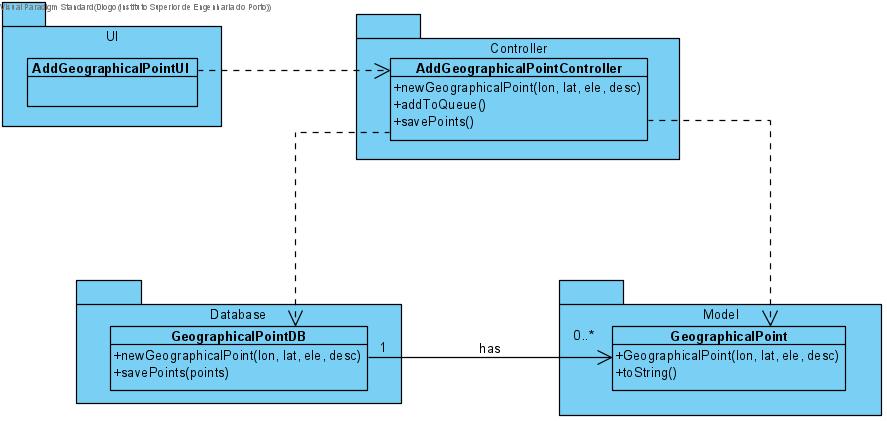

# UC18 - Add Path

## 1. Requirements Engineering
The administrator requests to add geographical points. The system request to insert the required data. The administrator inserts the required data (longitude, latitude, elevation, description). The system shows insert data and asks to confirm. The administrator confirms. The system informs about the sucess of the operation.

## SSD

#### Main Actor

(Super) Administrator

#### Stakeholders and their interests
* ** Courier: Wants points to be added so that he can know the best route for a certain delivery.	.

#### Pre Conditions
The administrator should be logged in.

## 2. Engineering Design

## Sequence Diagram

## Class Diagram

____

[Back to Use Cases](../UseCases.md)