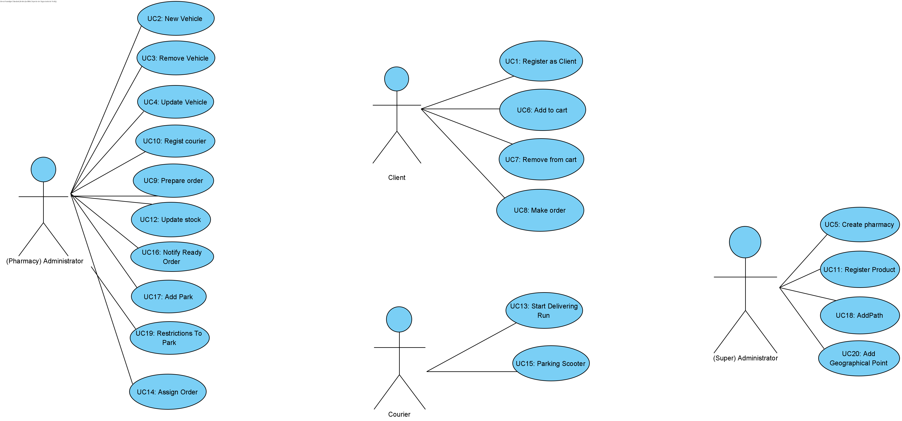

# Use Cases Diagram

A use case diagram was developed to understand the responsible actor or actors for the presented use cases.

# Use Cases
|  UC  | Description |                   
|:---- |:---- |
| UC01 | [Register as Client](UC01/UC1_RegisterAsClient.md) |
| UC02 | [New Vehicle](UC2/UC02_NewVehicle.md) |
| UC03 | [Remove Vehicle](UC03/UC3_RemoveVehicle.md) |
| UC04 | [Update Vehicle](UC04/UC4_UpdateVehicle.md) |
| UC05 | [Create Phamarcy](UC05/UC5_CreatePhamarcy.md) |
| UC06 | [Add to Cart](UC6/UC06_AddToCart.md) |
| UC07 | [Remove from Cart](UC07/UC7_RemoveFromCart.md) |
| UC08 | [Make Order](UC8/UC08_MakeOrder.md) |
| UC09 | [Prepare Order](UC09/UC9_PrepareOrder.md) |
| UC10 | [Regist Courier](UC10/UC10_RegistCourier.md) |
| UC11 | [Register Product](UC11/UC11_RegisterProduct.md) |
| UC12 | [Update Stock](UC12/UC12_UpdateStock.md) |
| UC13 | [Deliver Order](UC13/UC13_Deliver_Order.md) |
| UC14 | [Find Route](UC14/UC14_FindRoute.md) |
| UC15 | [Notify Scooter Docked](UC15/UC15_NotifyScooterDocked.md) |
| UC16 | [Notify Order Ready](UC16/UC16_OrderReady.md) |
---

[Back](../Documentation.md)
