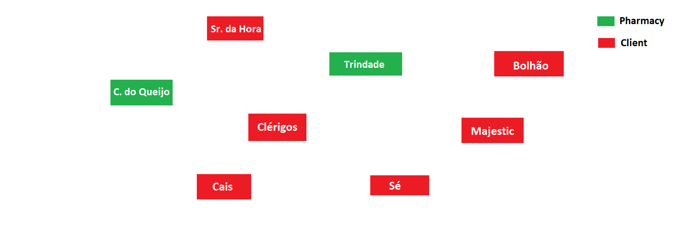
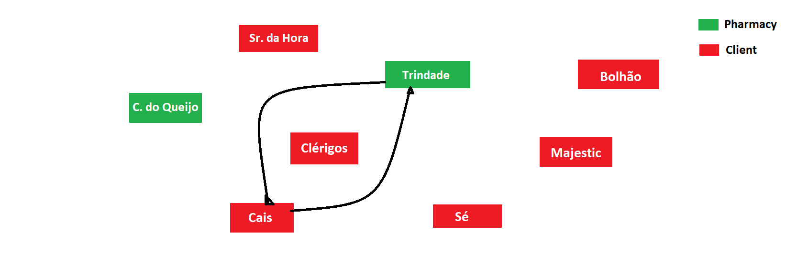

# Scenarios Description

There are 2 pharmacies and 5 clients registed. Each of them is represented as a geographical point. There are also 10 products registed in the system.

## 1. Scenario 01

### 1.1 Description
The client from Cais da Ribeira make an order with two valid products. There is only 2 paths defined: Trindade (Pharmacy) to Cais da Ribeira (Client) and the opposite.
All the pharmacies have enough stock.
The order is valid.

### 1.2 Expected result
The delivery run should be assinged to the pharmacy of Trindade because its nearer to the client.
The suggested route should be Trindade --> Cais da Ribeira --> Trindade.
The most efficent route is by air.
