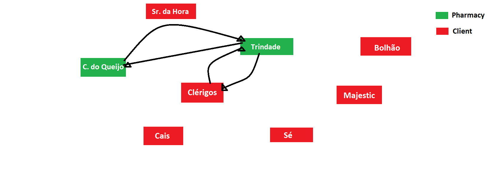

# Scenarios Description

There are 2 pharmacies and 5 clients registed. Each of them is represented as a geographical point. There are also 10 products registed in the system.

## 1. Scenario 01

### 1.1 Description
The client from Cais da Ribeira make an order with two valid products. There is only 2 paths defined: Trindade (Pharmacy) to Cais da Ribeira (Client) and the opposite.
All the pharmacies have enough stock.
The order is valid.

### 1.2 Expected result
The delivery run should be assinged to the pharmacy of Trindade because its nearer to the client.
The suggested route should be Trindade --> Cais da Ribeira --> Trindade.
The most efficent route is by air.

## 2. Scenario 02

### 2.1 Description
The client from Cais da Riberia make the same order with two valid products.This time there is a more possible paths and the direct path between trindade and cais da riberia no longer exists.
All the pharmacies has enough stock.
The order is valid.

### 2.2 Expected Result
The delivery run should be assigned to pharmacy of Trindade becaues its nearer to the cleint.
The suggested route should be Trindade --> Clerigos --> Bolhão --> Cais --> Bolhão --> Clérigos --> Trindade.

## 3. Scenario 03

### 3.1 Description
The client from Cais da Ribeira make the same order with two valid products.This time the parmacy assigned has no stock and therefore it must make a new order to the neared pharmacy.
The pharmacy Trindade has no enough stock.
The order is valid

### 3.2 Expected Result
The delivery run should be assigned to Trindade, and it must re-order the products missing from Castelo do Queijo Pharmacy.
A delivery note should be impressed.

## 4. Scenario 04

### 4.1 Description
The client from Cais da Ribeira and Bolhão make an order and it is assigned to Pharmacy Trindade.
Pharmacy has enough stock

## Expected Result
The orders must be asssigned to Pharmacy of Trindade.
There is no route.

